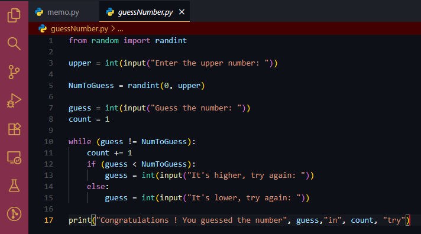

# Ayame Nakiri Theme for VS Code

A cozy, vibrant dark theme for Visual Studio Code. The UI uses a custom Ayame Nakiri inspired palette, while code syntax colors follow the familiar VS Code Dark+ scheme for maximum readability and language coverage.

## Preview

## Recommended Fonts
- 

## Contents
- first outfit ✓

## Changelog
- 1.1.0 — Refined UI palette, updated preview, improved consistency
- 1.0.0 — Initial release
